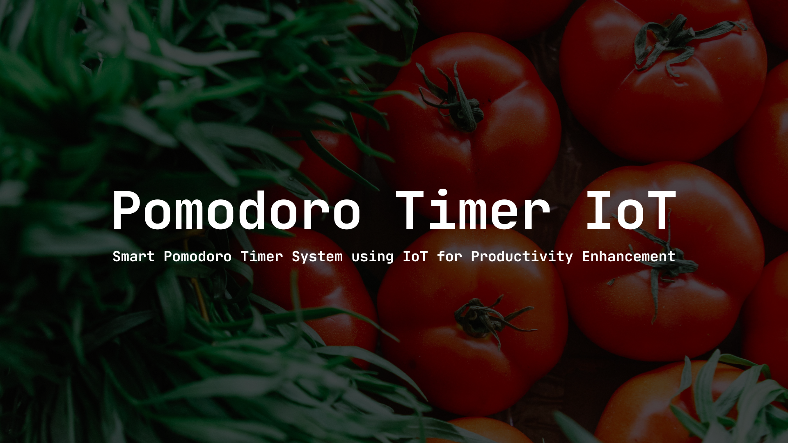

# Physical Computing Project 2025 - IT KMITL
**This repository is part of Physical Computing course @ School of Information Technology, KMITL**

  

# Pomodoro Timer
Pomodoro Timer

## 💻 Languages & Framework

## 🧑‍💻 Contributors
* [67070094](https://github.com/CyanKagami) บุญสิตา จงกลม
* [67070164](https://github.com/GEOFFCHARGE) วัลชัย กล่ำม่วง
* [67070167](https://github.com/WissanupongChanliem) วิษณุพงศ์ จันทร์เลี่ยม
* [67070179](https://github.com/67070179Smith) สมิต สารบรรณ
